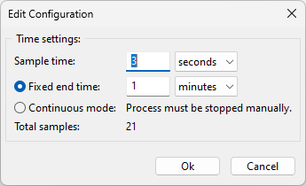

Create a configuration
======================

When the application starts, a new empty configuration is created with default values.
The configuration consist of three parts:

* Time settings
* Instruments
* Measurements

The toolbar has 4 buttons for handling the configuration.

The first button is for creating a new configuration with default values. All existing instruments
and measurements are deleted and all time settings are set to their default values.

The second button is for opening existing configurations. When the folder icon is clicked an
open file dialog is shown and a configuration file can be selected. If the file is valid the
configuration is loaded from the file. If the configuration is invalid, an error message will be
shown.
When the arrow next to the folder icon is clicked, a list of recent opened configurations is shown.
A maximum of 10 configurations is stored in this list and can be easily opened by selecting a
file from that list. In case the file no longer exists, the file is removed from the list.

The third button is for saving the configuration to a file. A save file dialog is shown to select a
location for saving the file. It is also possible to overwrite existing files if needed.

The fourth button is for changing the time settings.

Time settings
-------------

When clicking the forth button, the following dialog appears.

The sample time is the time between measurements. This time depends on your instruments.
If your instruments are fast, this time can be short. But if your instruments are slower,
or if you have a lot of measurements, this time should be longer. This time depends on how many
measurement are done on the slowest instrument. All measurements are performed parallel as much as
possible. When you have two instruments in your configuration and they both do one measurement,
both measurements can be processed parallel, because they are separate instruments. If you have two
measurements done on one instrument, they cannot be processed parallel. So if each measurement takes
up 1 second, the sample time should be larger than 2 seconds (two measurements). If the measurements
come in too slow, a time error will be reported. If this happens, you need to increase the sample
time or make the instruments measure faster.

The next time setting is the end time. You can choose for a fixed end time or continuous mode.
In the given example the end time is set to one minute. After 1 minute the measurements will stop
automatically. With a sample time of 3 seconds, this will give you 21 samples (1 at start and then
20 samples every 3 seconds for 60 seconds). The end time can also be set to continuous mode.
This way there is no end time and the measurements go on until manually stopped. The number of
samples will thus depend on when the process is stopped.
