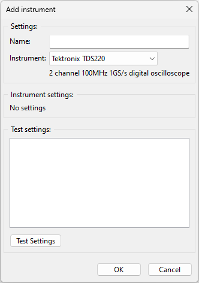
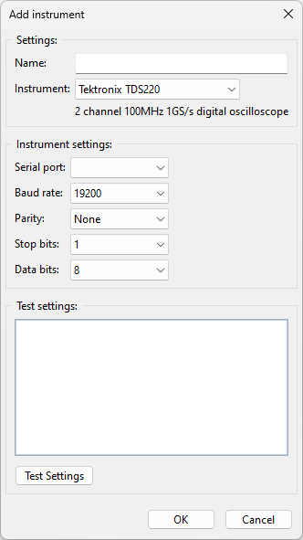
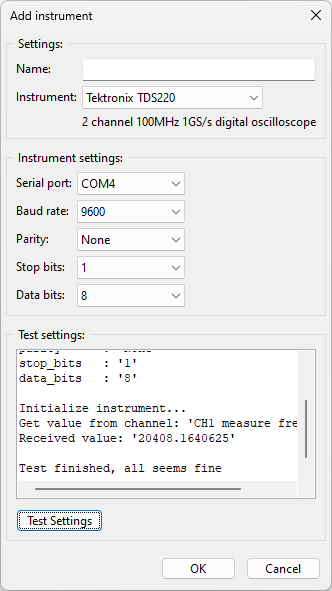

Creating your own instruments
=============================

It is impossible to have all instruments supported out of the box. Therefore there is a way to add
your own instruments. The instrument must comply to the following specifications:

* The communication protocol must be using ASCII characters.
* The interface should be serial, UDP or TCP.
* There must not be a user login procedure for the instrument (no authentication needed).

The instruments can be added by creating a JSON formatted file (driver) that defines all the
measurements for an instrument.

There are two ways to create a driver. From scratch or use an existing driver.

From scratch
------------

In this example we create a driver from scratch. This driver is for the Tektronix TDS220 oscilloscope.
We use the serial port to communicate with the instrument.

Instrument files must be stored in the user folder. Let's say your name is 'Joe', the following
folder should be present:

.. code-block:: console

    Windows: C:\Users\joe\LilyDataLoggerStudioCE
    Ubuntu : /home/joe/LilyDataLoggerStudioCE

To create a driver start by creating a text file. Best is to open a text editor and create a new file.
Save the file in the user folder and call it 'tek_tds220.json'. We start by adding the minimum
requirements for a driver. The minimum requirements are shown in the following example.

.. code-block:: json

  {
    "name": "Tektronix TDS220",
    "info": "2 channel 100MHz 1GS/s digital oscilloscope",
    "interface": {
    },
    "initialize": [
    ],
    "channels": [
    ]
  }

Copy this to the file and save it. Now start the application. Click the add instrument button.
If everything is correct, the instrument should be there:

If the instrument is not there, then the file probably contain errors. You can see this in the log
messages. Click the toolbar button at the right to show the log messages. For example the message
can look like this:

.. code-block:: console

  20240327 17:29:45.878 | STDOUT | Error reading file 'tek_tds220.json': Expecting ',' delimiter:
                                   line 8 column 3 (char 137)

Fix the errors and try again.

If the file is loaded correct, the name and description are there. Next step is to add the interface
settings. There are two attributes that needs to be added to the interface section. The interface
type and settings. The latter is optional, so we start with the type.

.. code-block:: json

  {
    "name": "Tektronix TDS220",
    "info": "2 channel 100MHz 1GS/s digital oscilloscope",
    "interface": {
      "type": "Serial port"
    },
    "initialize": [
    ],
    "channels": [
    ]
  }

The interface type must be one of the supported interfaces (see the chapter about the supported
interfaces). The name must match exactly with the name in the table (case sensitive).
After adding this, click the add instrument button and select the TDS220.

The application is using the default settings for the serial port settings. To overwrite one or
more default settings, we can add a settings section to the interface section.
More details about the settings can be found in the chapter about the serial port.
The TDS220 works by default on a baud rate of 9600. We add this to the interface settings.

.. code-block:: json

  {
    "name": "Tektronix TDS220",
    "info": "2 channel 100MHz 1GS/s digital oscilloscope",
    "interface": {
      "type": "Serial port",
      "settings": {
        "baud_rate": 9600
      }
    },
    "initialize": [
    ],
    "channels": [
    ]
  }

After adding this, click the add instrument button and select the TDS220. The baud rate should now
be automatically set to 9600.

The next section is the initialize section. The initialize section can be used to set up the
instrument before doing any measurements. This is optional. If no initialization is needed, just
keep the list empty. The initialization command are executed only one time, before starting the
measurements.

The TDS220 can do up to four measurements. But when doing all measurements at the same time,
the measurements get very slow. So we disable all measurements first.
We do this in the initialize section.

.. code-block:: json

  {
    "name": "Tektronix TDS220",
    "info": "2 channel 100MHz 1GS/s digital oscilloscope",
    "interface": {
      "type": "Serial port",
      "settings": {
        "baud_rate": 9600
      }
    },
    "initialize": [
      {
        "command": "measu:meas1:typ none\n"
      },
      {
        "command": "measu:meas2:typ none\n"
      },
      {
        "command": "measu:meas3:typ none\n"
      },
      {
        "command": "measu:meas4:typ none\n"
      }
    ],
    "channels": [
    ]
  }

The initialize section now has four commands that are send to the instrument. They disable all four
measurements. The '\n' at the end is the termination character. When the TDS receives this character,
it knows the command is finished. By default the termination character is the '\n' character (line
feed).

The last step is adding channels. Channels are the measurements. We start with adding one channel
for measuring frequency on channel 1.

.. code-block:: json

  {
    "name": "Tektronix TDS220",
    "info": "2 channel 100MHz 1GS/s digital oscilloscope",
    "interface": {
      "type": "Serial port",
      "settings": {
        "baud_rate": 9600
      }
    },
    "initialize": [
      {
        "command": "measu:meas1:typ none\n"
      },
      {
        "command": "measu:meas2:typ none\n"
      },
      {
        "command": "measu:meas3:typ none\n"
      },
      {
        "command": "measu:meas4:typ none\n"
      }
    ],
    "channels": [
      {
        "name": "CH1 measure frequency",
        "type": "input",
        "command_list": [
          {
            "command": "measu:meas1:sou ch1\n"
          },
          {
            "command": "measu:meas1:typ freq\n"
          },
          {
            "command": "instrument_delay:1.2\n"
          },
          {
            "command": "measu:meas1:val?\n",
            "response": "{float}\n"
          }
        ]
      }
    ]
  }

The name identifies the measurement and must be unique. The type is set to 'input'. This tells the
application that it is a measurement. To do a measurement on the TDS220 we need to setup
the channel number and the measurement type (first 2 commands). Then the TDS220 requires a second
to do a measurement. We insert a delay of a little bit longer than 1 second to let the TDS220 do a
measurement. Finally we get the result by querying for the measured value. The response is a floating
point number representing the measured value.

Click the add instrument button and select the TDS220. If you really have one connected, you can
click the 'Test settings' button to test if everything is working.

As shown in the image the measurement returns a value for the measured frequency. Note that the
test only uses the first channel for testing. In the same way more measurements can be added.

Command and responses
---------------------

In the initialize and channel's command list section you can define commands that can be send to
the instrument.
Also you can define the expected responses. A command can be defined without response in case the
command does not give any response (like most commands in the TDS220).
Also commands can return values. The values can be identified by a special phrase (like {float}
in the measurement of the TDS).
The following examples show possible command and responses.
The commands can also be special commands (see the chapter about special commands).

.. code-block:: json

  // Command without a response
  {
    "command": "measu:meas1:typ none\n"
  }

  // Command with a fixed response
  {
    "command": "measu:meas1:typ none\n",
    "response": "ack\n"
  }

  // Command sending a string
  {
    "command": "id?\n",
    "response": "{str}\n"
  }

  // Command sending an integer value
  {
    "command": "acq:numav?\n",
    "response": "{int}\n"
  }

  // Command sending a float
  {
    "command": "measu:meas1:val?\n",
    "response": "{float}\n"
  }

In the above examples the responses only contain the value followed by a termination character ('\n').
Some instruments can have a response with some character preceding the value and/or characters after
the value. This can also be implemented:

.. code-block:: json

  {
    "command": "volt:dc?\n",
    "response": "volt:dc={float}V\n"
  }

In this example the measured value is preceded by 'volt:dc=' and followed by 'V' and the termination
character.

Using an existing driver
------------------------

You can use an already existing driver. This is convenient if the instrument you want to add is
similar to an already existing one. The instrument must be added to the configuration first.

In the toolbar on the main view is a download button (next to the export CSV). Select an instrument
from the instruments list and click the download button. As example below is part of the download
of the Arduino DAQ driver.

.. code-block:: json

  {
    "name": "Arduino DAQ",
    "info": "Read and write digital IO and read analog values with an Arduino",
    "interface": {
      "type": "Serial port",
      "settings": {
        "baud_rate": 115200
      }
    },
    "initialize": [
      {
        "command": "interface:toggle_dtr"
      },
      {
        "command": "instrument_delay:2"
      },
      {
        "command": "rd2\n",
        "response": "{int}\n"
      }
    ],
    "channels": [
      {
        "name": "D2 get state",
        "type": "input",
        "command_list": [
          {
            "command": "rd2\n",
            "response": "{int}\n"
          }
        ]
      },
      {
        "name": "A0 get voltage",
        "type": "input",
        "command_list": [
          {
            "command": "ra0\n",
            "response": "{float}\n"
          }
        ]
      }
    ]
  }

Not all channels are shown in the example. After download you can modify it to you needs.
