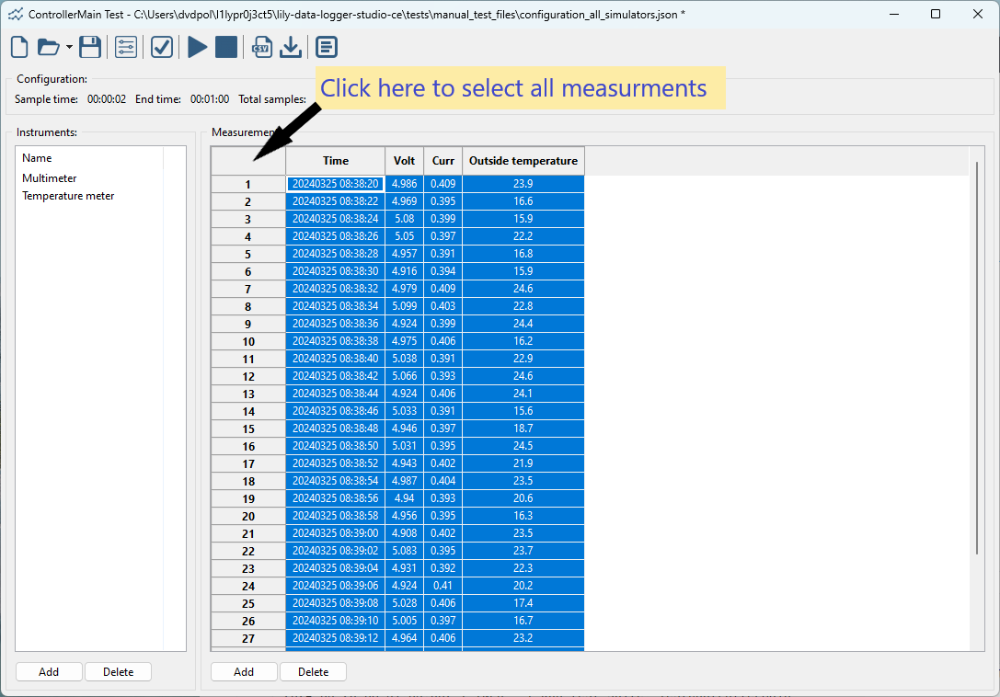
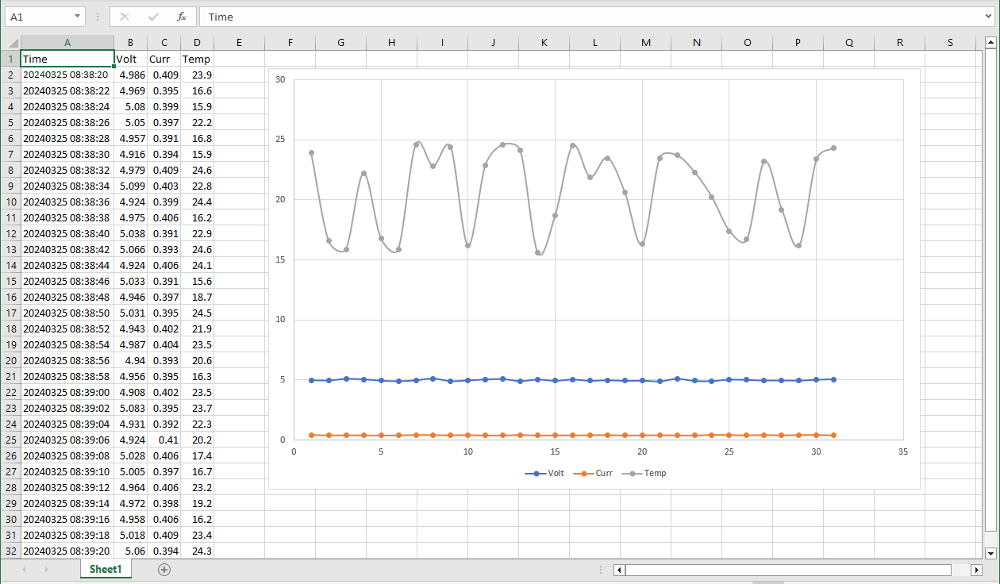
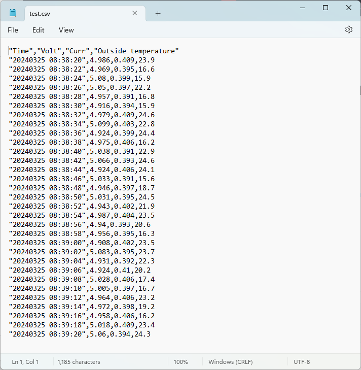

Export measurements
===================

When all your measurements are done, you may want to save the measurements for further analysis,
or make a graph. There are two ways to export the measurement data.

Copy and paste
--------------

The first one is using copy and paste. This is the most simplest way. Just select all the
measurements in the table and press 'Ctrl-C' to copy the measurements to the clipboard.
The simplest way to select all measurements is to click on the cell in the top left corner.

After selecting all measurements, press 'Ctrl-C'. Now open your favorite spreadsheet application
(Excel, LibreOffice, Google spreadsheets, etc.).
In the spreadsheet select the cell where you want the measurement data and press 'Ctrl-V'.
Now all measurements are copied to the spreadsheet.

When the measurement data is in the spreadsheet, some graphs can be easily created.

Export to CSV
-------------

The measurements can also be exported to a file. The file is CSV format (CSV = comma separated values).
This file can easily be read by text editors or various programming languages. This way the
measurement data can be imported into for example a database. Refer to the manual of the software
for details on how to import data from a CSV file.

To create a CSV file, click on the toolbar button with the CSV document icon. Enter a filename and
save it.

Now you can open the file in a text editor to check if all measurements are properly exported.
