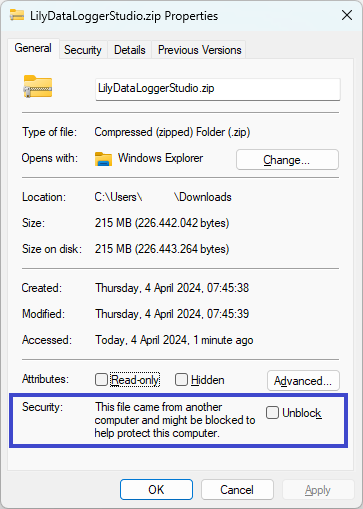

Installation
============

Installing the Lily Data Logger Studio is very easy. After downloading the release package, extract
the package to a folder of your choosing. After extracting the files, you can use the application.
There is no installer. This makes it easy to run the application from an USB stick or other
removable media.

Downloading
-----------

The package can be downloaded from https://www.lilytronics.nl/lily-data-logger-studio .
There are two downloads: one for Windows and one for Ubuntu. Click on the appropriate link to
start the download. If you have problems downloading the file, let us know.

After downloading you may need to 'unblock' the zip file. Open the file explorer and go to the folder
where the zip file is. Right click with the mouse on the zip file and select properties from
the context menu. At the bottom is a security section where you can unblock the file (marked in blue).

Note that the filename may be different and depends on the version you have downloaded.
Click the 'Unblock' checkbox and click the 'OK' button.

Extracting the files
--------------------

Unfortunately Windows Defender sees our software as a threat. We can guaranty that this is not the issue.
To use the software you need to add it as exception to the Windows Defender.
We are looking into this to solve this in a more elegant way.

First create a folder where you want to install the application, for example:
``C:\LilyDataLoggerStudio``. But this can be any other folder you like. Also on Ubuntu this may
be a different name. Open the zip file and extract the files to that folder.
After extracting the files, the following files/folders should be there:

.. code-block:: console

    \LilyDataLoggerStudioCE
      |- \lib\
      |- \lily_arduino_daq\
      |    |- lily_arduino_daq.ino
      |- LilyDataLogerStudioCE.exe

Description of the files/folders:

* LilyDataLogerStudioCE.exe: this is the application executable. Double click on this file to
  start the application. This is the executable for Windows. On Ubuntu the executable has the same
  name but without the extension (.exe).
* lib: this folder contains all the required libraries for running the application.
  This folder is required for running the application and should not be removed.
* lily_arduino_daq.ino: this is the Arduino sketch that can be programmed into your Arduino board.
  After programming you can get and set the digital IO states and read the analog voltages.
  This can be used with the application. See the chapter about the Arduino DAQ for more details.

The application creates a folder in the user's folder. Let's say your name is 'Joe', the following
folder will be created when the application is started and the folder does not exist:

.. code-block:: console

    Windows: C:\Users\joe\LilyDataLoggerStudioCE
    Ubuntu : /home/joe/LilyDataLoggerStudioCE

This folder will contain at least two files:

* LilyDataLoggerStudioCE.json: these are the application settings. If you see strange behavior,
  just delete this file and the application will use the default settings.
* LilyDataLoggerStudioCE.log: this is the log file. When running the application, log messages
  are written to this file. In case of strange behavior, you can check this file for any messages
  that may lead to the cause of the strange behavior.

In this folder one or more instrument files can be stored. The application scans this folder for
any instrument files. In case of valid instrument files, the instruments will be added to the
application and can be used. See the chapter about adding your own instruments for more details.
