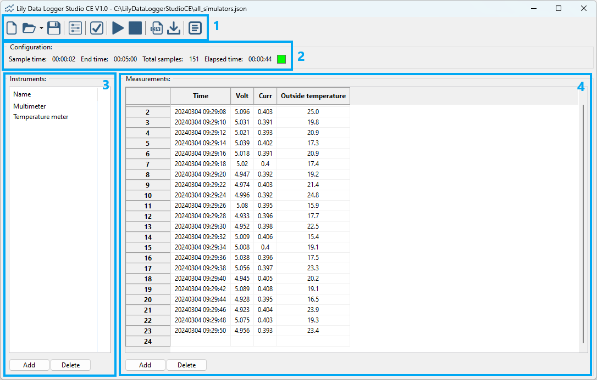

Main view
============

When starting the application, the main view will be shown.

The main view has the following sections:

1. The toolbar. The toolbar contains the main controls for using the application.
  The toolbar contains the following buttons, left to right:

  * New configuration: create a new configuration.
  * Open configuration: open an existing configuration. At the right of the button is a small arrow.
    Clicking on that arrow shows a list of recently opened configurations.
  * Save configuration: save the current configuration to a file. Note that measurement data is not saved.
  * Configuration settings. This opens a dialog for changing the configuration settings.
  * Check instruments. This opens a dialog in which you can check if your instruments are ready.
    It will connect to the instruments and if possible do a measurement.
  * Start measurements. This starts the measurements.
  * Stop measurements. This stops the measurements.
  * Export to CSV. This exports the measurement data to a CSV file.
  * Export instrument. This exports the selected instrument to a file.
  * Show log. This shows the log messages generated by the application.

2. Configuration information. This area shows all information about the active configuration.
3. Instruments. This area contains the list of instruments and buttons for adding and deleting instruments.
4. Measurements. This area contains the table with measurement data and buttons for adding and deleting measurements.

More details can be found in their respective chapter.
