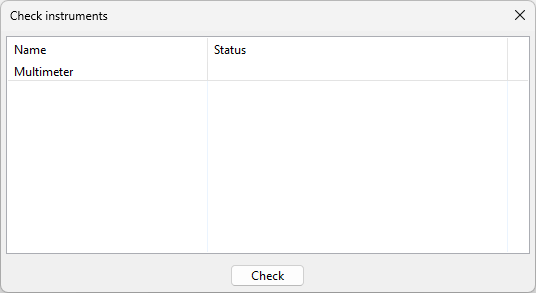
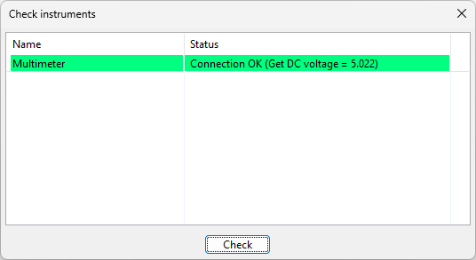

Running a configuration
=======================

In the previous chapters, we added an instrument and a measurement. When everything is setup to
your needs, you can start the measurements.

Checking instruments
--------------------

Before starting the measurements you can check if the instruments are properly configured. This is
optional and not required, but good practice to make sure your instruments are operating good.
On the toolbar is a button with a checkbox. Click that button and the following dialog will show:

The list shows the instruments that are in the configuration. Even if the instruments are not used
in the measurements they are still listed here. Click the 'Check' button to start checking the
instruments. After the process is finished, the results are shown:

As shown in the image the check was successful (all is green). If something is not good the color is
orange and an error message will be shown. If that is the case, check the instrument settings to
make sure the settings are correct.

Start the measurements
----------------------

On the toolbar is a button with a play icon. Click that button to start the measurements. First the
instruments will be initialized. If the initialization fails, the process is stopped with an error
message. This will happen if an instrument is not properly configured or responding. Check the
instrument settings to solve this issue.

After the initialization, the measurements start. At the interval set by the sample time,
measurements are done. If possible measurements are processed in parallel. This depends on your
configuration.

During the measurements the elapsed time in the configuration information is updated and the
green LED is blinking.

When doing the measurements the following errors can occur:

* time error: a request for a measurement is made at a certain time. If for some reason the response
  comes too late (at the next interval or later), a time error is reported. You should stop the
  measurements and investigate why the response is too late. It can be, but not limited to, one
  of the following reasons:

  * The measurement just takes some time to complete. Then increase the sample time.
  * Too many measurements on one single instrument. If a lot of measurements are done on a
    single instrument, the measurements are queuing and this causes delay in the measurements.
    Increase the sample time. Or add additional instruments to your setup and spread the measurements
    over multiple instruments.
  * The instrument is broke and does not respond well. Replace the instrument and see if this solves
    the issue.

* an error message: this message starts with 'ERROR' followed by some error message. This usually
  happens if the instrument is not configured properly or the instrument suddenly is not responding
  anymore (connection issue). You should stop the measurements and check the settings of the
  instruments, or check the physical connection between the instrument and the PC (cables, power
  supplies, etc.). The instrument might also be broke and needs to be replaced.

Stop the measurements
---------------------

Measurements stop in two conditions:

* The end time is reached. If an end time is set in the configuration and the end time is reached,
  the measurements are stopped.
* The stop button is clicked. In the toolbar is a button with a stop icon. When that button is clicked
  the measurements are stopped.

When the measurements are stopped, the elapsed time is no longer updated and the green LED stops blinking.

Measurements can be started again after they stopped. When doing so, the measurement table will be cleared.
If you wish to keep the current measurements you should export the measurements first before restarting
the measurements (see the chapter about exporting measurement data).
