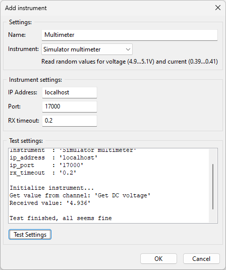

Setup instruments
=================

This chapter describes how to add the multimeter simulator.
Below the list of instruments are two buttons. One for adding instruments and one for deleting instruments.

Click the add button to add an instrument. The following dialog will show:

.. image:: images/add_instrument_empty.png

All fields are empty and should be filled out.

First enter a name for the instrument. This can be any name as long as it is unique. Instruments
are identified by their name. Instruments can be renamed at any time, so no worry if the name is
not correct, it can be changed later. For now we name the instrument 'Multimeter'.

From the dropdown list, select the instrument driver. There are some pre installed drivers.
You can add your own drivers, we will discuss that later. From the dropdown list select:
'Simulator multimeter'. The dialog is updated with a description of the instrument and the default
settings.

The simulator is running on 'localhost' at port number 17000. If this does not mean anything to you,
just take it as is and do not worry anything. The RX timeout is 0.2 seconds.
Within this time we expect a response. In case you experience errors, you can increase this to see
if that solve your issues. Because it is a simulator, the responses will come very fast so a small
timeout should be sufficient.

To test the settings, click the 'Test settings' button. The result will be shown in the textbox.
If all is well, it should work.

As you can see in the image, the tests are passed and the instrument is working.
Now click OK to save the instrument to the configuration.
The instrument is added to the list of instruments.

To change the instrument settings, double click on the instrument in the list. The dialog will shown
and the settings can be changed. Also the settings can be tested again.

To delete the instrument, select the instrument in the list (single click) and click the delete button.
After confirmation, the instrument is deleted from the configuration and removed from the list.
