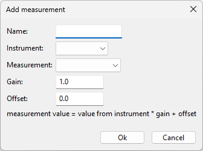
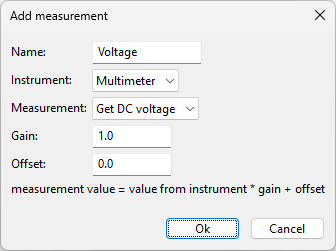

Setup measurements
==================

All measurements are stored in a spreadsheet like table. Below the table are two buttons.
One for adding measurements and one for deleting measurements. Measurements can only be added
when there are instruments. In the previous chapter we added the multimeter simulator.
In this chapter we will add a measurement from the multimeter.

Click the add button to add a measurement. The following dialog will show:

All fields are empty and should be filled out.

First enter a name for the measurement. This can be any name as long as it is unique. Measurements
are identified by their name. Measurements can be renamed at any time, so no worry if the name is
not correct, it can be changed later. For now we name the measurement 'Voltage'.

Next select the instrument 'Multimeter' from the dropdown list. And next select the measurement.
The multimeter has two measurements 'DC voltage' and 'DC current'. In this example we will add the
voltage measurement so select 'Get DC voltage' from the list.

For each measurement you can set a gain and a offset. The value measured by the instrument is
multiplied with the gain and the offset is added to that. The outcome is the the value that is
written to the table. This gain and offset can be used to measure values from sensors and convert
them to real values. We will explain this more in the following example.

Let's say we have a voltmeter connected to a temperature sensor. This temperature sensor is the
LM335. This sensor delivers an output voltage of 10mV/K (K=Kelvin). Let's say our temperature is 295K.
Then our voltage is: 295 * 0.01 = 2.95V. The table will show then 2.95. Using the gain, we can make
the value in the table show 295. All we need to do is set the gain to 100 and the offset to 0.
The value in the table will be 2.95V * 100 + 0 = 295. The temperature in Kelvin. This makes
it easier to read te values in the table. If we want to have the temperature in degrees celsius,
we simply need to set the offset to -273.15. Then the value in the table will be
2.95V * 100 - 273.15 = 21.85. The table then will show the temperature in degrees celsius.

Back to our example. In our example we just want to display the actual value from the instrument.
So we leave the gain to 1 and the offset to 0.

Now click OK to save the measurement to the configuration. The measurement is added to the table.

To change the measurement settings, double click on the measurement name in the table.
The dialog will shown and the settings can be changed.

To delete the measurement, select the measurement in the table (single click on the name) and
click the delete button. After confirmation, the measurement is deleted from the configuration and
removed from the table.
