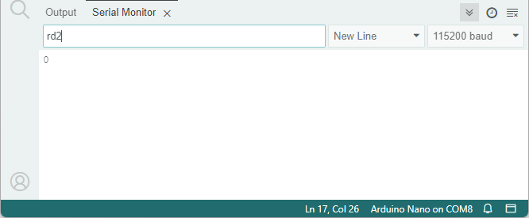
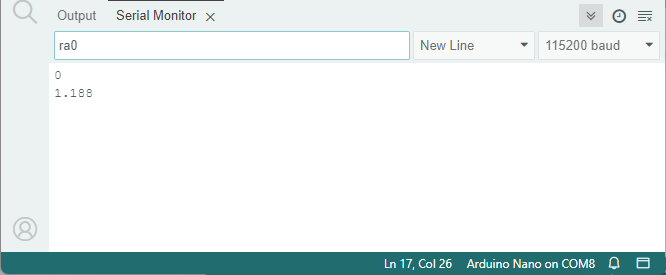
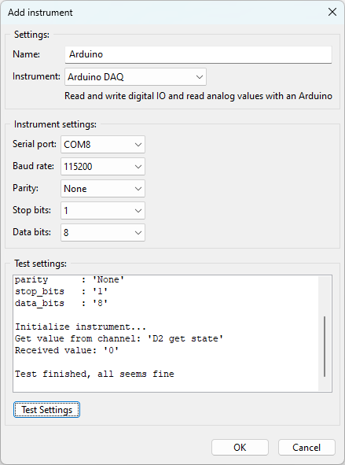

Using an Arduino board
======================

The Arduino platform is an ideal platform for doing measurements. You can monitor digital and
analog signals. All you need is to write a small firmware program to get the signals from the
various IO pins using the serial port. Every Arduino board has a serial port.
This can be used with the Lily Data Logger Studio. This page describes how to set it up.

Preparing the Arduino board
---------------------------

First the Arduino board needs to be prepared. We assume you already have some experience with
programming sketches into an Arduino board, if not, get some experience first by reading the
documentation on https://docs.arduino.cc/ . When you are familiar with programming the Arduino,
come back to this page.

This application comes with a basic sketch for doing some simple measurements with an Arduino board.
This sketch can be found in the download package and is called: ``lily_arduino_daq.ino``.

Open this sketch in the Arduino IDE. The sketch can do three things:

* Read digital IO pins. The state of a digital IO pin (D2, D3, etc.) can be read.
* Write digital IO pins. The state of a digital IO pin can be set to 1 (5V) or 0 (0V).
* Read analog input pins. The value of the analog input pins (A0, A1, etc.) can be read.

Writing the IO pins is not supported by the application. We can only read IO pins (measurements).

Now connect your Arduino board to the computer and program the sketch into your board. To verify
if the board is working you can open the serial port monitor in the Arduino IDE. Type in the command:
``rd2``. Make sure line ending is set to 'New Line'. and the speed to 115200 baud. This command will
read the state of digital IO D2. The returned value should be a '0' or a '1'.
You can also try to read an analog value with the command: ``ra0``.
This will read the value from analog input A0. The returned value should be between 0 and 5V.
See the screenshots below.

In our case the digital input is '0' and the analog input is 1.188V.

Adding the Arduino to Lily Data Logger Studio
---------------------------------------------

Close the Arduino IDE to make sure the serial port is no longer used by the IDE.
Now we can add the Arduino measurements to the application. Start the application.
First we add the Arduino board as an instrument. Click on the add instrument button.

Name the instrument and select the instrument: 'Arduino DAQ'. After selecting the Arduino DAQ,
the serial ports are detected. This can take a few moments depending on your system.
Then select the proper serial port in our case it is 'COM8', but this completely depends on your
system. All other settings (baud rate, parity, etc.) should be good. No need to change them
Then click the 'Test settings' button to test the settings. As a test it reads the state of D2.
When all is fine, click the OK button to save the settings.
